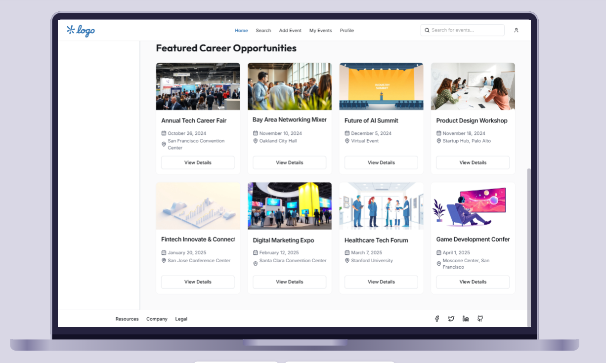
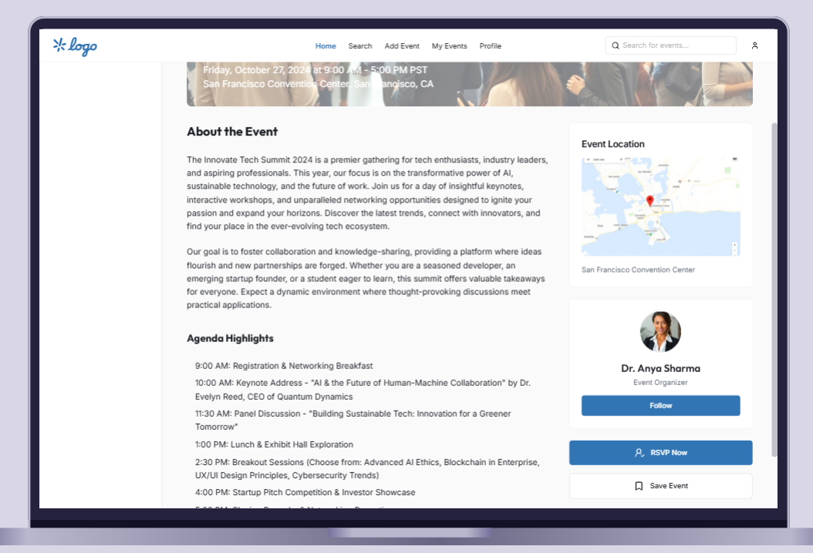
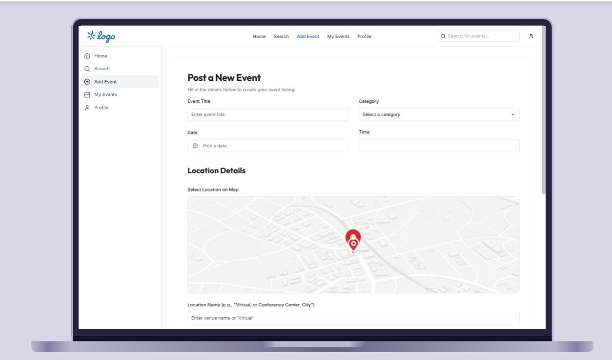
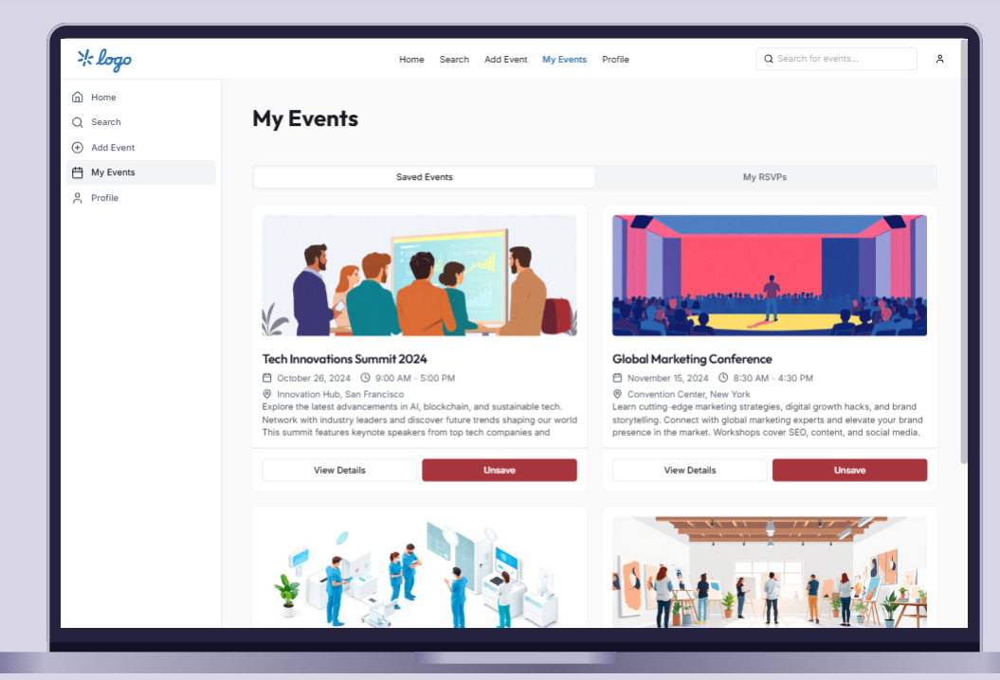
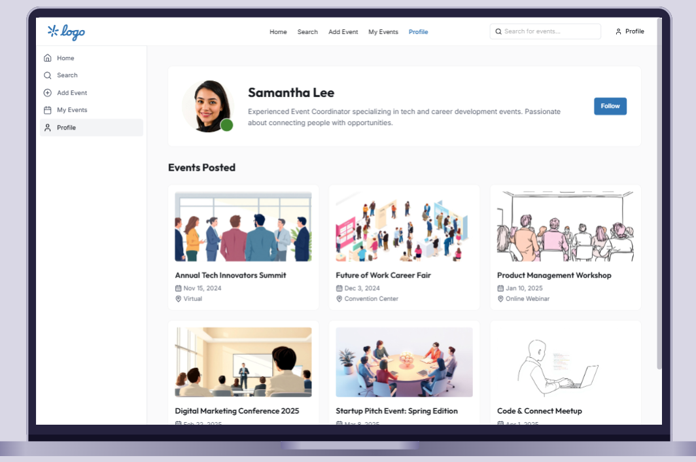

# EventLinker

EventLinker is a mobile application designed to connect users with events around them, providing an easy way to search, explore, create, and manage events.  

---

## 📌 Features

### **Feature 1: Event Search & Map View**
Easily find upcoming events with an interactive search and map interface.  

**Functionality:**
- Search events by keywords.
- View event locations on an interactive map with pins.
- Filter events by category tags (Jobs, Networking, Industry Tracks).

---

### **Feature 2: Event Details Page**
Access full information about any event to make informed decisions before attending.  

**Functionality:**
- View event title, date, time, and location.
- Read a detailed description of the event.
- See organizer information and venue details.
- RSVP, Save, or Share the event.

---

### **Feature 3: Post New Event**
Create and share your own events with the community.  

**Functionality:**
- Enter event title, category, date/time, and location.
- Add a detailed event description.
- Pin the location on an interactive map.
- Upload an event image.
- Publish the event for others to see.

---

### **Feature 4: My Events (Saved & RSVPs)**
Keep track of events you’re interested in or attending.  

**Functionality:**
- View saved events and RSVPs in separate tabs.
- Quickly access event details.
- Manage your saved events list.

---

### **Feature 5: Profile & Posted Events**
Showcase your posted events and manage your profile.  

**Functionality:**
- Display user profile information.
- List events posted by the user.
- View and manage posted events.

